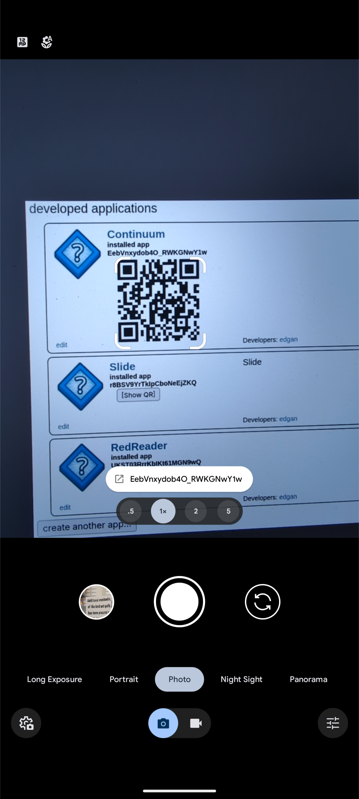

# Reddit app helper

This is a browser extension for `Chrome` based browsers and `Firefox` to add a `QR code` per [Client ID](https://github.com/edgan/Slide/blob/master/SETUP.md#reddit-client-id) to the page when on [https://www.reddit.com/prefs/apps](https://www.reddit.com/prefs/apps) or [https://old.reddit.com/prefs/apps](https://old.reddit.com/prefs/apps). Then you can scan the QR code in a Reddit app, a QR code scanner, [Google Lens](https://play.google.com/store/apps/details?id=com.google.ar.lens&hl=en_US), or [Google Camera](https://play.google.com/store/apps/details?id=com.google.android.GoogleCamera&hl=en_US).

## Example screenshots

> [!NOTE]
>
> These are just example `client IDs`, and have been removed.

### Without QR code

### With QR code

### With Google Camera

